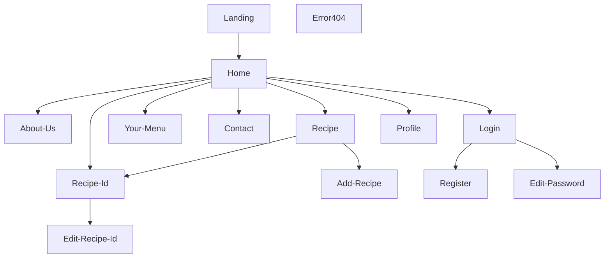

## Concept

Vegan Witch Pot is a community based website made by [Laynaria](https://github.com/Laynaria) for sharing vegan recipes. Guests can access recipes that are shared by users and approved by admins. Users can create their own recipes and decide to share them or keep them for themselves. They can also create their own weekly menu of recipes and get a shopping list to ease their groceries.

There is three level of authentified users :

- Users > They can create recipes and asks for approval.
- Cooks > They can approve their own recipes.
- Admins.

## Features

### In the current version

- View and access recipes.
- Filters for recipes page (name, type, time, difficulty, my recipes).
- Authentification. (Login, Register and Disconnect)
- Profile Editing. (Change Password, Email, Avatar, Delete User)
- Create & Edit Recipes. (Title, Type, Cooking Time, Picture, Difficulty)
- Delete Recipes.
- Uploading Pictures. (User Avatar and Recipe Thumbnail)
- Contact for both authentified users and guests.

### Upcoming

- Create & Edit Recipes : Ingredients, Steps, Sharing, Approval.
- Weekly Menu.
- Shopping List.
- More Security.
- Forgotten Password.
- Commentary on Recipes.
- Quality Of Life improvements.
- Admin Pannel.

## App Structure

## Setup & Use

### Project Initialization

- In VSCode, install plugins **Prettier - Code formatter** and **ESLint** and configure them
- Clone this repo, enter it
- Run command `npm run setup`
- _NB: To launch the backend server, you'll need an environment file with database credentials. You'll find a template one in `backend/.env.sample`_

### Available Commands

- `setup` : Initialization of frontend and backend, as well as all toolings
- `migrate` : Run the database migration script
- `dev` : Starts both servers (frontend + backend) in one terminal
- `dev-front` : Starts the React frontend server
- `dev-back` : Starts the Express backend server
- `lint` : Runs validation tools, and refuses unclean code (will be executed on every _commit_)
- `fix` : Fixes linter errors (run it if `lint` growls on your code !)

## FAQ

- The Template used for this project is a fullstack foundation template made by the Wild Code School.
- All pictures and icons from this project are open source. Most of them come from lotifiles, iconify and unsplash. The witch avatar though comes from the artist [Freepik](https://www.flaticon.com/fr/auteurs/freepik) from Flaticon platform.
- Don't forget to create your frontend and backend .env files by copying the `.env.sample files` from each directory.

### Technologies

- React
- Node
- Express
- MySQL

### Tools

- _Concurrently_ : Allows for several commands to run concurrently in the same CLI
- _Husky_ : Allows to execute specific commands that trigger on _git_ events
- _Vite_ : Alternative to _Create-React-App_, packaging less tools for a more fluid experience
- _ESLint_ : "Quality of code" tool, ensures chosen rules will be enforced
- _Prettier_ : "Quality of code" tool as well, focuses on the styleguide
- _ Airbnb Standard_ : One of the most known "standards", even though it's not officially linked to ES/JS
- _Nodemon_ : Allows to restart the server everytime a .js file is udated
